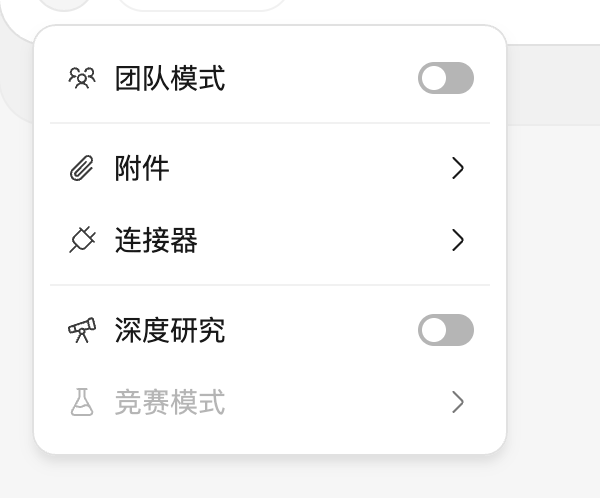
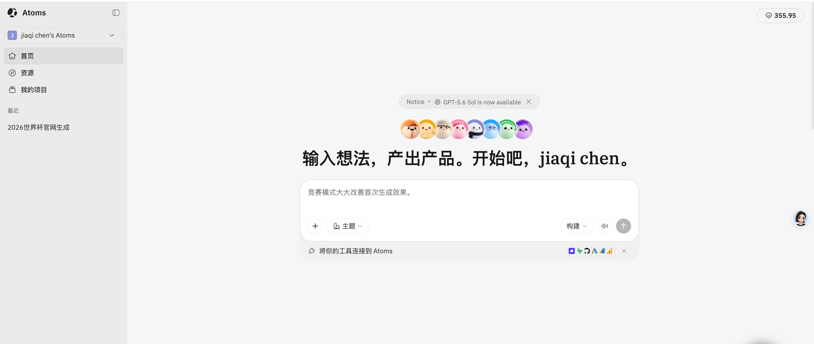
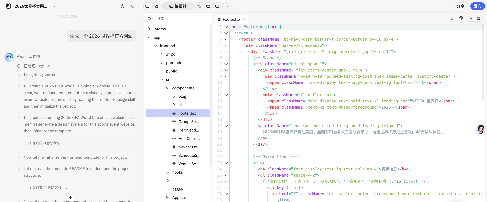
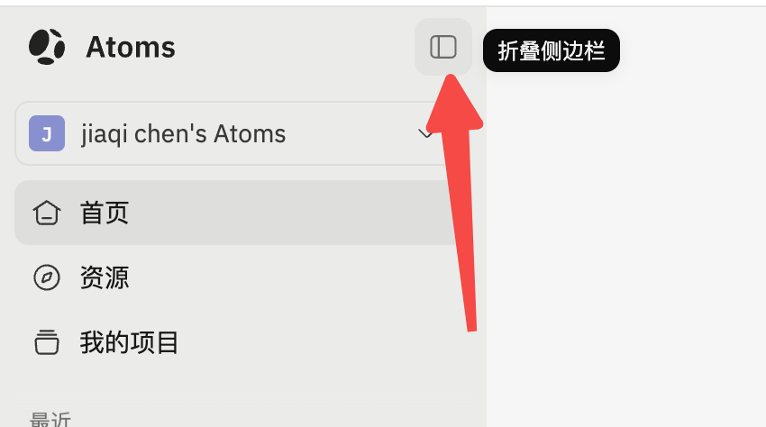
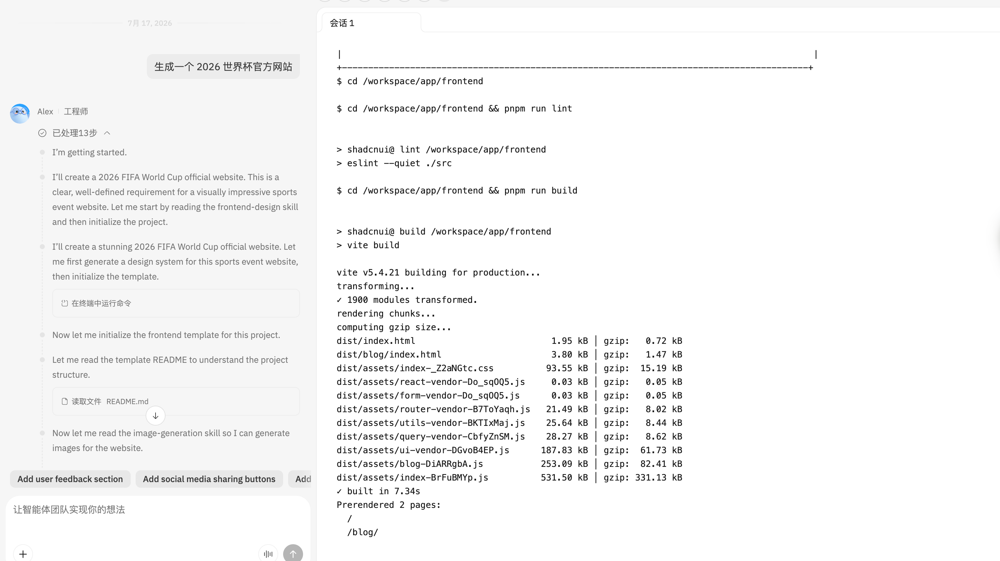

# Coding Agent Demo（飞书原始需求归档）

> 来源：[飞书知识库原文](https://my.feishu.cn/wiki/EYYiwLTPgilIHbkY62Rc2Bftnjd)
>
> 归档说明：本文件保留原始需求与技术方向，仅调整图片为本地相对路径。后续拆分出的任务需求文档位于 `docs/requirements/`，其中不包含技术实现细节。

# 需求背景

完成一个 **Atoms Demo**：实现一个可运行的网页应用，具备类似 Atoms 的能力与 UI 交互体验，即通过智能体驱动的方式完成代码（应用）生成，并将生成的应用以可视化网页形式进行展示。

# 功能

## 注册

注册，目前先使用游客模式，只允许创建、查看和切换游客，不可删除游客列表，简单实现账号功能，不涉及 Google 注册。

1. 默认会有一个 default 名字的游客，如果用户不想创建自己的游客账号，就可以使用 default 账号体验功能。
2. 在进入页面前，先展示一个页面：供用户选择或创建游客，选择之后浏览器记住用户选择的结果，用户切换功能时候以选择的为准，不能串号。

## 首页

参考 Atoms 的布局样式：

1. 左边是 tab 功能区：只需要包括游客列表下拉切换、首页 tab、我的项目 tab 即可。
2. 右边是对话输入交互区：展示一句 slogan + 游客名，同时有个文本输入框，输入框下面 + 号展开会展示类似下面列表，目前只需要一个附件功能即可；输入框右下角有个发送按钮即可；暂时不需要其他功能。

Atoms 参考图：

## Agent 对话 UI

打开我的项目中具体的项目或者在首页发送内容请求，就会进入到另外一个页面；布局：

1. 左边是对话区。
2. 右边是应用查看器/文件树浏览器/终端查看器/文件查看器。

在执行过程中，如果遇到：

1. 执行终端命令，则右边展示终端查看器，展示具体命令和执行结果。
2. 执行文件写命令时，展示文件写入的过程（比如完整写一个文件过程中，先写 100 行，那需要实时展示 100 行，查看器随着写入进行滚动保证看到最新的数据）。
3. 生成完成，如果是网页应用，默认打开应用查看器，如果不是，则打开文件树浏览器，同时树能够有些标志展示文件编辑状态：更新、新建两个状态。

Atoms 参考图：

## 后续访谈补充参考图

以下图片由需求访谈补充，用于参考“我的项目”卡片展示：

以下图片由需求访谈补充，用于参考侧边栏折叠入口：

以下图片由需求访谈补充，用于参考终端会话的连续命令与输出展示：

# 技术

## Pi agent

<https://github.com/earendil-works/pi>

使用 Pi agent 作为底层的 agent runtime，web UI 和 agent runtime 不直接耦合，它们之间通过事件通知来实现 UI 更新。

## 容器资源

本项目直接部署在 Google 的 ECS 实例中，每个游客拥有自己独立的目录存放项目、对话 session 等资源，目录规范：`/workspace/${游客名}/`，目录内容：

- `/workspace/${游客名}/projects/${项目名}`：游客项目，保存项目的产物。
- `/workspace/${游客名}/sessions/${session_id}`：对话 session 内容，它是 Pi agent 的 agent session JSONL 内容。
