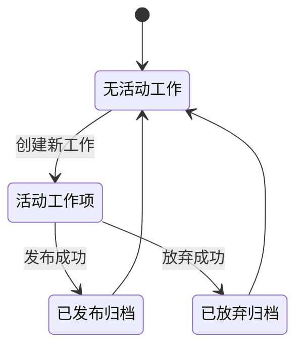
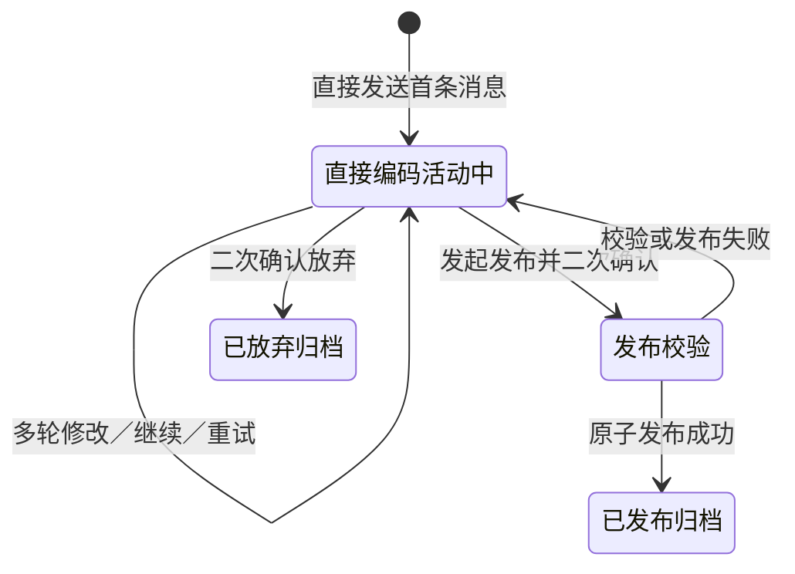
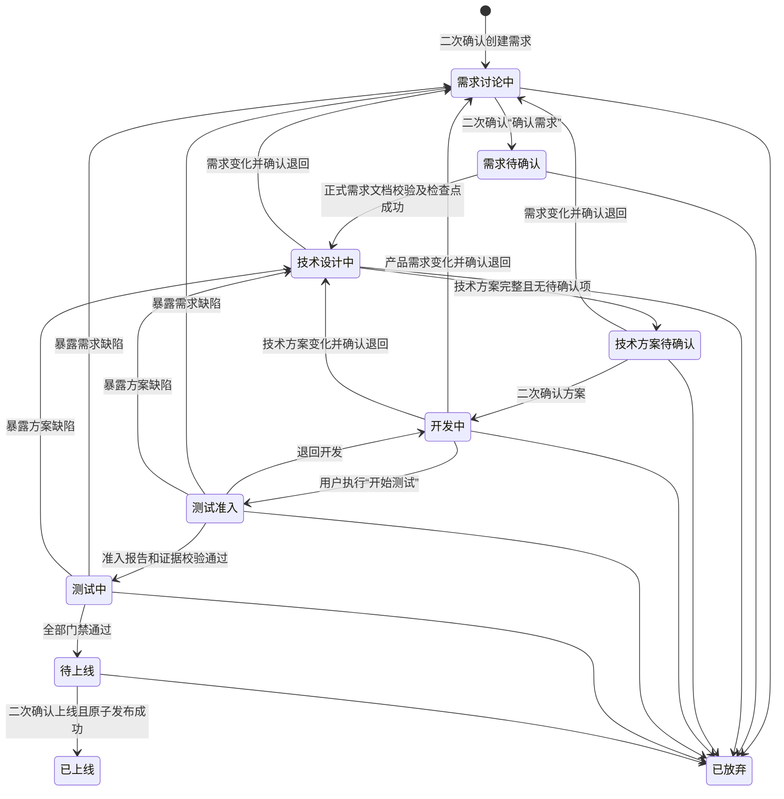

# 直接编码与需求研发状态机（需求基准）

本文仅根据 `docs/requirements/` 中的需求文档整理，用于逐项校验代码实现。本文不根据当前代码反推规则；当本文与实现不一致时，应先回到引用的原子需求确认产品口径。

## 1. 共同的工作项生命周期



两种模式共享以下约束：

1. 每个项目同一时刻最多有一个未归档工作项，结构化需求与直接编码不能并存。
2. 当前工作项发布或放弃前，禁止创建另一工作项。
3. 每个工作项创建独立的 conversation、session 和终端上下文。
4. 同一工作项内的多轮对话持续使用同一 session；新工作项不能继承旧 session。
5. 工作项发布或放弃后归档，不能继续接收消息或修改标题。
6. 归档后的下一项工作必须创建新的工作项。
7. 创建结构化需求必须二次确认；确认前不能创建工作项、分支、对话或 session。
8. 创建结构化需求前，工作区必须与当前正式版本一致；存在未发布直接编码改动时，必须先发布或放弃。

来源：

- [77 创建项目工作项](./requirements/77-create-project-work-item.md)
- [78 选择模式开始新工作](./requirements/78-start-work-in-selected-mode.md)
- [79 隔离工作项对话与执行会话](./requirements/79-isolate-work-item-conversation-and-session.md)
- [80 限制单个活动工作项](./requirements/80-limit-one-active-work-item.md)

## 2. 直接编码状态机

需求文档没有为直接编码定义多个结构化流程阶段。它是一个持续可编辑的活动工作项，直到发布或放弃。



### 2.1 创建直接编码工作项

进入条件：

1. 项目不存在其他活动工作项。
2. 用户在无活动工作项时直接发送内容。
3. 系统从当前正式版本创建独立工作分支。
4. 系统创建新的 conversation、session 和空终端上下文。
5. 直接编码不创建 `Rxxx` 编号、需求文档或技术方案。

创建后第一条消息即可读取和写入业务代码、安装依赖及执行命令。

### 2.2 单轮执行结果

| 单轮结果 | 工作项处理 | 内部检查点 |
| --- | --- | --- |
| 成功且受跟踪文件有变化 | 保持“直接编码活动中” | 创建 |
| 成功但没有文件变化 | 保持“直接编码活动中” | 不创建 |
| 执行失败 | 保留当前现场，等待继续或重试 | 不创建完成检查点 |
| 用户停止 | 保留当前现场，等待继续或重试 | 不创建完成检查点 |

文件变化必须相对工作项开始时的正式版本累计计算，不能只比较最近一轮。

### 2.3 发布流转

#### 进入发布校验

1. 用户通过按钮或自然语言发起“发布代码版本”。
2. 系统根据当前工作项的完整对话和累计 Diff 生成标题与摘要。
3. 用户可以在确认框中修改标题与摘要。
4. 每次发布尝试必须二次确认；取消确认时状态和文件均不得变化。

#### 发布门禁

发布前需要检查：

- 项目已有测试；
- 类型检查；
- Lint；
- 构建；
- 敏感文件；
- 预览启动。

没有自动化脚本时允许发布，但必须明确标记，并完成最低文件、配置和预览验证。任一适用门禁失败都必须阻止发布，不支持强制忽略。

#### 发布失败

1. 工作项保持活动，不归档。
2. 不占用正式版本号。
3. 不得暴露半成品正式版本。
4. 再次尝试发布必须重新二次确认。

#### 发布成功

1. 使用 `--no-ff` 将工作分支合入 `main`。
2. 与结构化需求共享 `V1、V2…` 正式版本序列。
3. 生成不可变发布记录，且不得伪造需求编号、需求文档或技术方案。
4. 一个直接编码工作项最多发布一个正式版本。
5. 工作项、对话和 session 归档。
6. 后续修改必须创建新的工作项。

### 2.4 放弃直接编码

1. 支持按钮和自然语言发起。
2. 必须二次确认；取消确认时不改变状态或文件。
3. 工作区恢复当前正式版本；没有正式版本时恢复初始化基线。
4. 未发布代码被清除，不提供历史代码或恢复能力。
5. 对话、终端、session、放弃原因和时间作为工作记录保留。
6. 工作项归档后允许创建新工作项。

来源：

- [89 执行直接编码工作项](./requirements/89-run-direct-coding-work-item.md)
- [90 发布直接编码代码版本](./requirements/90-publish-direct-code-version.md)
- [91 放弃活动工作](./requirements/91-abandon-active-work.md)

## 3. 结构化需求状态机

结合 83 号与后续 102 号需求，结构化需求的完整状态机为：



### 3.1 无活动工作 → 需求讨论中

守卫条件：

1. 项目不存在活动工作项。
2. 工作区与当前正式版本一致。
3. 不存在未发布直接编码改动。
4. 用户通过入口或自然语言创建结构化需求。
5. 用户完成二次确认。
6. 确认后才创建工作项、`Rxxx` 编号、分支、conversation 和 session。

### 3.2 需求讨论中

允许：

- 读取和搜索代码；
- 逐题澄清产品决策；
- 增量维护需求草稿；
- 记录用户明确给出的技术约束。

禁止：

- 修改业务代码；
- 安装依赖；
- 执行产生业务改动的命令；
- 自行展开技术架构、API 或数据模型等设计。

流转到“需求待确认”：

1. 产品目标、范围、非目标和验收标准已形成共同理解。
2. 用户触发“确认需求”。
3. 完成二次确认；取消确认则保持当前状态。

### 3.3 需求待确认

该阶段实际表示“用户已经确认，系统正在正式整理和校验需求文档”。

流转到“技术设计中”必须全部满足：

1. 自动完成正式需求文档整理轮次。
2. 文档写入 `docs/requirements/Rxxx-*/`。
3. 文档通过存在性和结构校验。
4. 文档不存在未解决的“待确认”项。
5. 创建需求确认内部检查点。

任何一步失败都必须停留在“需求待确认”，不得启动技术设计。

### 3.4 技术设计中

进入阶段后，系统自动启动技术设计任务，无需用户再次发送指令。

允许：

- 读取已确认需求文档；
- 探索当前代码；
- 维护技术方案草稿；
- 询问重大产品影响、兼容性、迁移和风险取舍。

禁止：

- 提前修改业务代码；
- 修改已确认需求文档；
- 反问能依据项目惯例自行确定的普通实现细节。

技术文档强制章节完整、所有不适用章节有明确说明且不存在待确认项后，自动进入“技术方案待确认”。

### 3.5 技术方案待确认

流转到“开发中”需要：

1. 用户触发“确认方案并开始开发”。
2. 完成二次确认。
3. 锁定技术方案。
4. 创建技术方案确认内部检查点。
5. 自动开始开发。

取消确认时应保持原状态，不能修改业务代码。

### 3.6 开发中

允许：

- 修改项目代码；
- 安装依赖；
- 构建和测试；
- 修复已确认范围内的实现缺陷。

限制：

- 已确认需求文档和技术方案只读。
- 阶段内每条消息不产生碎片 commit。
- 只有实现确实完成后才能产生“实现完成”检查点。

停止、失败和恢复：

1. 停止或失败后继续停留在开发阶段。
2. 保留未提交现场。
3. 不自动续跑。
4. 继续或重试前重新读取文件、Diff、待办和最近检查点。

范围变化：

- 改变功能、流程、数据、权限或验收标准：暂停开发，提出退回需求讨论的待确认动作。
- 修改已确认技术方案：提出退回技术设计的待确认动作。
- 仅属于确认范围内的实现缺陷：留在开发阶段修复。

### 3.7 开发中 → 测试准入

用户执行“开始测试”后：

1. 首个可见阶段必须是“测试准入”，不能直接进入“测试中”。
2. “开始测试”未被列入必须二次确认的动作。
3. 准入检查已确认需求文档、技术方案、实现完整性、自动化测试，以及项目实际存在的类型检查、Lint 和构建。
4. 全部通过后必须生成机器可校验的 `docs/test-reports/Rxxx-admission.json`。

结果处理：

| 准入结果 | 状态处理 |
| --- | --- |
| 报告及全部证据通过服务端校验 | 自动进入“测试中” |
| 确认范围内的代码或测试问题 | 自动修复并复检，保持“测试准入” |
| 暴露需求范围缺陷 | 停留准入，提示退回需求讨论 |
| 暴露技术方案缺陷 | 停留准入，提示退回技术设计 |
| 任务异常或无法修复 | 停留准入，允许手动重新执行 |
| 报告校验失败 | 同一会话最多自动重试两轮，之后等待用户处理 |

### 3.8 测试中

必须完成：

- 项目已有测试；
- 类型检查；
- Lint；
- 构建；
- 技术方案指定命令；
- 每条需求验收标准到验证结果的映射；
- 涉及界面时验证桌面端与移动端关键流程；
- 生成完整测试报告。

结果处理：

1. 确认范围内的失败允许自动修复，但必须重新执行受影响测试和最终完整验收。
2. 暴露需求缺陷时停止自动修复，并提出退回需求讨论。
3. 暴露技术方案缺陷时停止自动修复，并提出退回技术设计。
4. 任一必测项失败、证据缺失或存在未说明的跳过项时，禁止进入待上线。
5. 全部门禁通过后创建“测试通过”检查点、冻结候选版本并进入待上线。

### 3.9 待上线

状态特征：

- 候选代码、技术方案和测试报告被冻结；
- 网页项目显示“待上线预览 · Rxxx”；
- 网页预览启动失败时禁止上线；
- 非网页项目可以跳过预览门禁。

流转到“已上线”：

1. 用户通过按钮或自然语言发起“确认上线”。
2. 用户完成二次确认。
3. 系统复检发布门禁。
4. 合并、tag、版本记录、当前版本切换、正式预览和发布记录作为一个原子事务完成。

发布失败：

- 保持待上线；
- 不占用版本号；
- 不暴露半成品版本；
- 由用户手动重试。

发布成功：

- 使用 `--no-ff` 合入 `main`；
- 分配下一个 `Vn` 和 `code/vn` tag；
- 删除工作分支引用但保留提交历史；
- 归档工作项；
- 对话变为只读。

### 3.10 任意未归档阶段 → 已放弃

1. 支持按钮和自然语言发起。
2. 必须二次确认。
3. 放弃前创建“放弃快照”内部提交。
4. 保留需求编号、分支、对话、session、文档、终端、检查点、放弃原因和时间。
5. 不合入 `main`，不创建正式版本。
6. 已放弃需求不能恢复或继续。
7. 工作项归档后允许创建新工作项。

来源：

- [81 逐题访谈结构化需求](./requirements/81-interview-structured-requirement.md)
- [82 维护需求文档](./requirements/82-maintain-requirement-documents.md)
- [83 控制工作流阶段流转](./requirements/83-control-workflow-transitions.md)
- [84 生成并确认技术方案](./requirements/84-generate-technical-design.md)
- [85 限制各阶段写入权限](./requirements/85-enforce-phase-write-permissions.md)
- [86 实现结构化需求](./requirements/86-implement-structured-requirement.md)
- [87 测试结构化需求](./requirements/87-test-structured-requirement.md)
- [88 发布结构化需求代码版本](./requirements/88-publish-structured-code-version.md)
- [91 放弃活动工作](./requirements/91-abandon-active-work.md)
- [102 测试阶段准入检查](./requirements/102-gate-entry-to-testing.md)

## 4. 流程状态与执行状态分离

以下状态是附加在当前流程阶段上的执行状态，不是新的流程阶段：

- 运行中；
- 已停止；
- 执行失败；
- 等待重试。

推荐按以下语义理解：

```text
workflowStage = 开发中
executionState = 执行失败
```

而不是：

```text
开发中 → 执行失败阶段 → 开发中
```

执行控制规则：

1. 存在运行中任务或排队消息时，禁止阶段流转，唯一例外是“停止”。
2. 停止需要二次确认。
3. 继续执行和重试当前阶段不需要二次确认。
4. 停止或失败后不能自动跨阶段。
5. 普通对话不能隐式改变阶段。
6. 按钮和自然语言必须进入同一个动作识别、确认和服务端守卫机制。

来源：[83 控制工作流阶段流转](./requirements/83-control-workflow-transitions.md)。

## 5. 二次确认矩阵

| 动作 | 是否需要二次确认 |
| --- | --- |
| 新建结构化需求 | 是 |
| 确认需求 | 是 |
| 确认方案并开始开发 | 是 |
| 确认上线 | 是 |
| 发布直接编码版本 | 是 |
| 退回阶段 | 是 |
| 放弃需求 | 是 |
| 放弃未发布直接编码改动 | 是 |
| 停止任务 | 是 |
| 继续执行 | 否 |
| 重试当前阶段 | 否 |
| 普通对话 | 否 |
| 查看操作 | 否 |
| 开始测试 | 文档未列为需确认动作 |

所有二次确认均遵守：

- 只确认操作后果，不实现内容哈希失效机制；
- 取消后状态和文件不发生变化；
- 发布失败后的下一次发布必须重新确认；
- 按钮与自然语言触发相同的待确认动作。

## 6. 阶段写权限矩阵

| 阶段 | 允许写入 | 禁止或锁定 |
| --- | --- | --- |
| 需求讨论中 | 需求草稿、被引用的需求资产 | 业务代码、依赖和业务改动命令 |
| 需求待确认 | 正式需求文档整理所需文件 | 不得提前修改业务代码 |
| 技术设计中 | 技术方案草稿、长期技术决策 | 业务代码、已确认需求文档 |
| 技术方案待确认 | 文档未明确新增写入范围 | 确认前不得修改业务代码 |
| 开发中 | 业务代码、依赖、构建和测试 | 已确认需求文档、已确认技术方案 |
| 测试准入 | 确认范围内的代码与测试修复、准入报告 | 已确认需求和技术方案 |
| 测试中 | 测试、报告及确认范围内修复 | 已确认需求和技术方案 |
| 待上线 | 原则上无候选内容写入 | 候选代码、技术方案、测试报告冻结 |
| 已上线／已放弃 | 无活动写入 | 工作项整体只读 |

任何阶段都不能写入平台管理目录、Git 元数据、其他工作项 session 或项目外路径。终端命令不能绕过上述文档和阶段锁。

来源：[85 限制各阶段写入权限](./requirements/85-enforce-phase-write-permissions.md)。

## 7. 代码比对检查表

### 7.1 工作项和会话

- [ ] 项目级唯一活动工作项由服务端强制。
- [ ] 结构化需求和直接编码不能同时活动。
- [ ] 归档工作项拒绝新消息和标题修改。
- [ ] 每个新工作项创建独立 conversation、session 和终端上下文。
- [ ] 结构化需求确认创建前没有分支、会话、session 等副作用。
- [ ] 发布或放弃后，新消息创建全新工作项。

### 7.2 流转和执行状态

- [ ] 流程阶段与执行状态分开存储。
- [ ] 运行中或存在排队消息时，除停止外拒绝阶段流转。
- [ ] 停止、继续、重试不会隐式跨阶段。
- [ ] 前进只能逐阶段执行，不能越级或重复执行。
- [ ] 已上线工作项不能退回。
- [ ] 所有危险动作统一走二次确认。
- [ ] 取消二次确认时状态和文件均无变化。
- [ ] 按钮和自然语言使用相同的服务端动作与守卫。

### 7.3 结构化需求

- [ ] 需求讨论和技术设计阶段无法通过终端绕过业务代码写保护。
- [ ] 正式需求文档校验失败时停留在需求待确认。
- [ ] 技术方案存在待确认项时不能进入技术方案待确认。
- [ ] 确认方案前不能修改业务代码。
- [ ] 已确认文档在开发、准入、测试和待上线阶段只读。
- [ ] 产品需求变化要求退回需求讨论。
- [ ] 技术方案变化要求退回技术设计。
- [ ] “开始测试”后首先进入测试准入，而非直接进入测试。
- [ ] 准入报告和证据通过服务端校验后才进入正式测试。
- [ ] 任一必测项失败、证据缺失或未说明跳过时不能进入待上线。
- [ ] 待上线候选被冻结，发布失败后仍保持待上线。
- [ ] 结构化需求放弃后保留快照和分支，但不能继续或恢复。

### 7.4 直接编码

- [ ] 直接编码从当前正式版本创建独立分支。
- [ ] 成功且有文件变化的轮次创建内部检查点。
- [ ] 无变化、失败或停止的轮次不创建完成检查点。
- [ ] 累计 Diff 相对于工作项开始时的正式版本计算。
- [ ] 发布标题和摘要根据完整工作项对话与累计 Diff 生成。
- [ ] 发布失败后工作项仍活动，且再次发布要求重新确认。
- [ ] 没有自动化脚本时只允许走明确披露的最低验证例外。
- [ ] 一个直接编码工作项最多发布一个正式版本。
- [ ] 放弃直接编码后恢复正式版本并清除未发布代码。

### 7.5 发布原子性

- [ ] 两种模式共享连续且不可复用的 `Vn` 序列。
- [ ] 版本号仅在发布成功时占用。
- [ ] 合并、tag、版本记录、当前版本切换、正式预览和发布记录全有或全无。
- [ ] 发布失败不会暴露半成品版本。
- [ ] 发布成功后工作项归档且历史对话只读。

## 8. 需求口径待统一项

### 8.1 “测试准入”是否属于正式流程阶段

[83 控制工作流阶段流转](./requirements/83-control-workflow-transitions.md)列出的状态没有“测试准入”，但后续的[102 测试阶段准入检查](./requirements/102-gate-entry-to-testing.md)明确要求它成为点击“开始测试”后的首个可见阶段。

本文暂按后续需求处理：将“测试准入”纳入结构化需求状态机，位于“开发中”和“测试中”之间。

### 8.2 “实现完成”检查点的创建时机

[86 实现结构化需求](./requirements/86-implement-structured-requirement.md)要求实现完成后自动创建“实现完成”检查点；[102 测试阶段准入检查](./requirements/102-gate-entry-to-testing.md)又要求准入报告通过后创建实现检查点。

代码校验前需要进一步明确：

- 方案 A：开发任务结束且实现完成时创建；
- 方案 B：测试准入通过后创建；
- 方案 C：开发完成先创建候选检查点，准入通过后再确认或生成正式实现检查点。

在产品口径明确前，不应仅根据现有实现判定其中一种必然正确。
